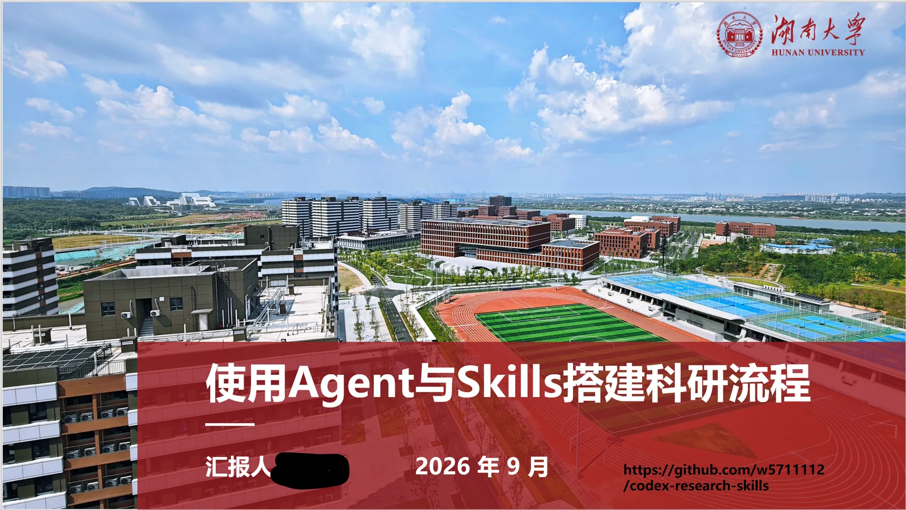
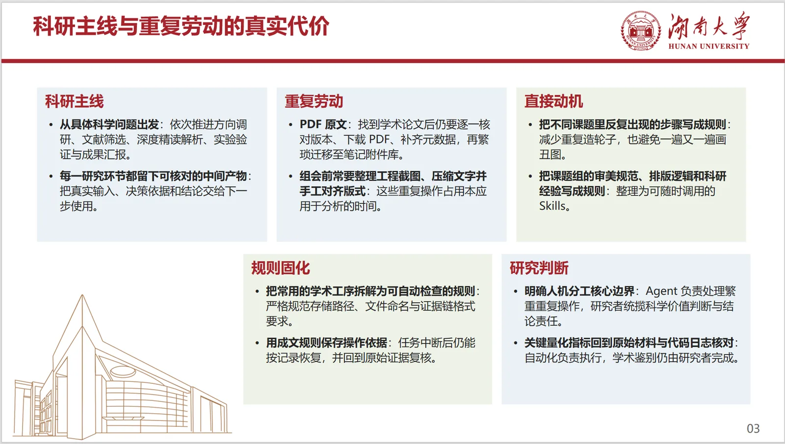
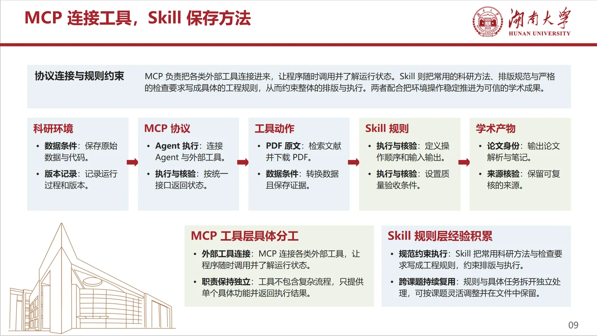
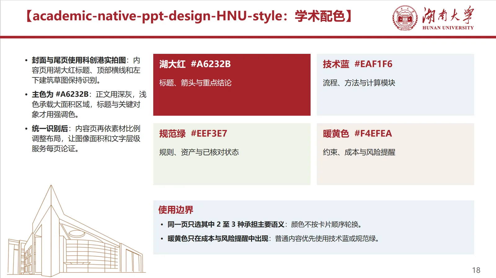
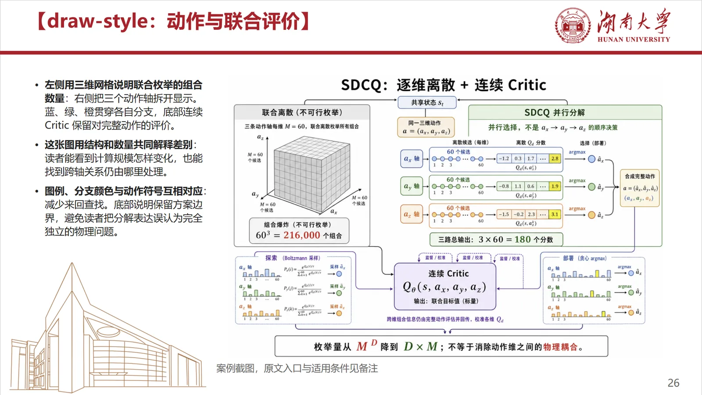
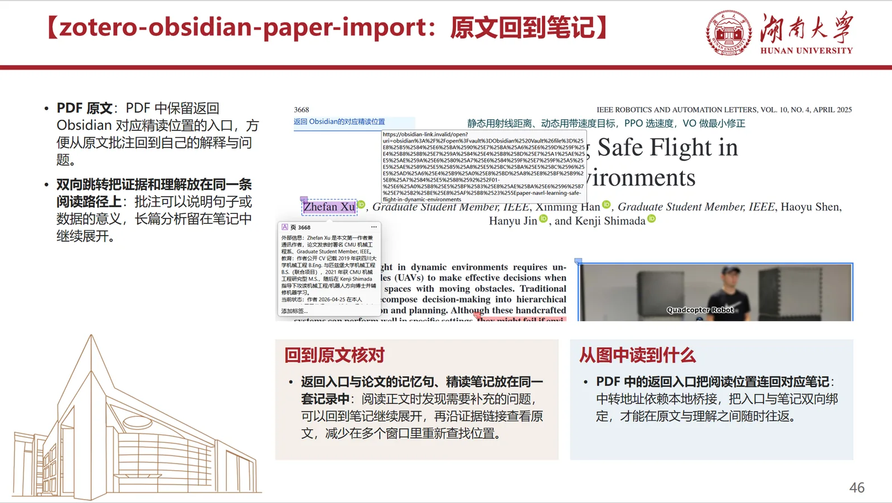
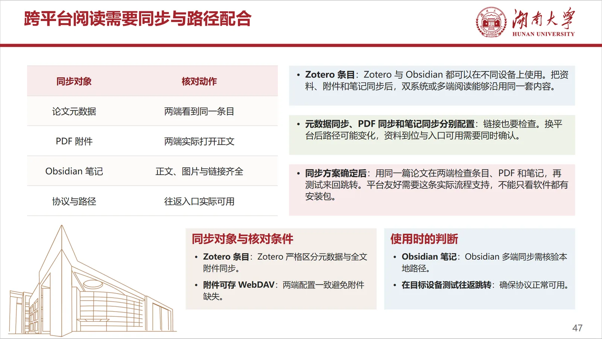
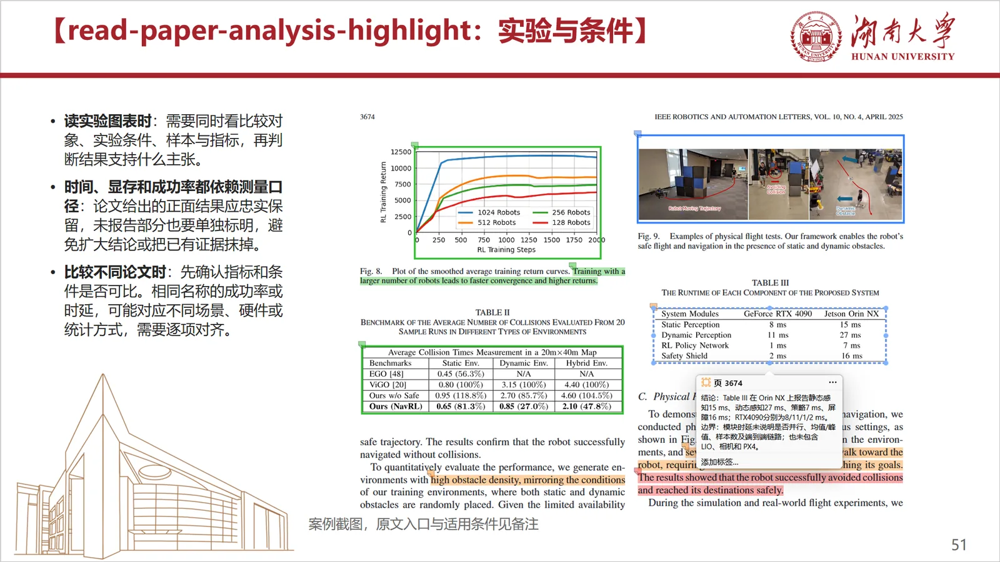
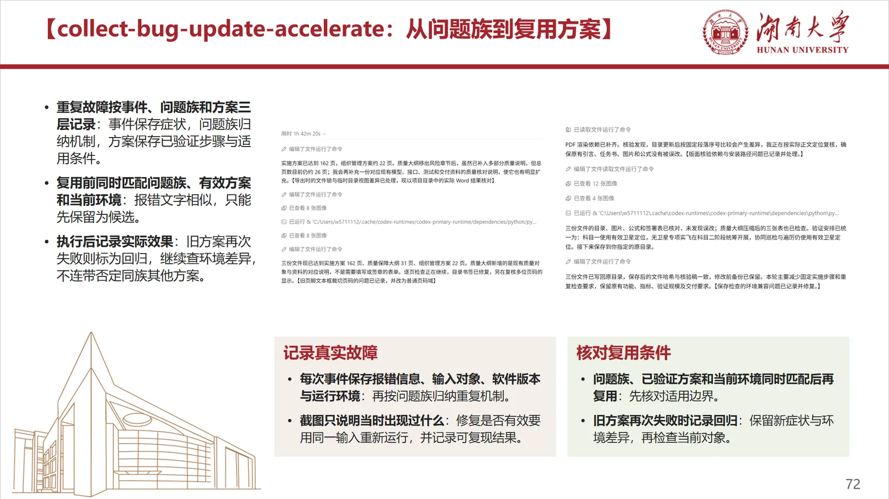
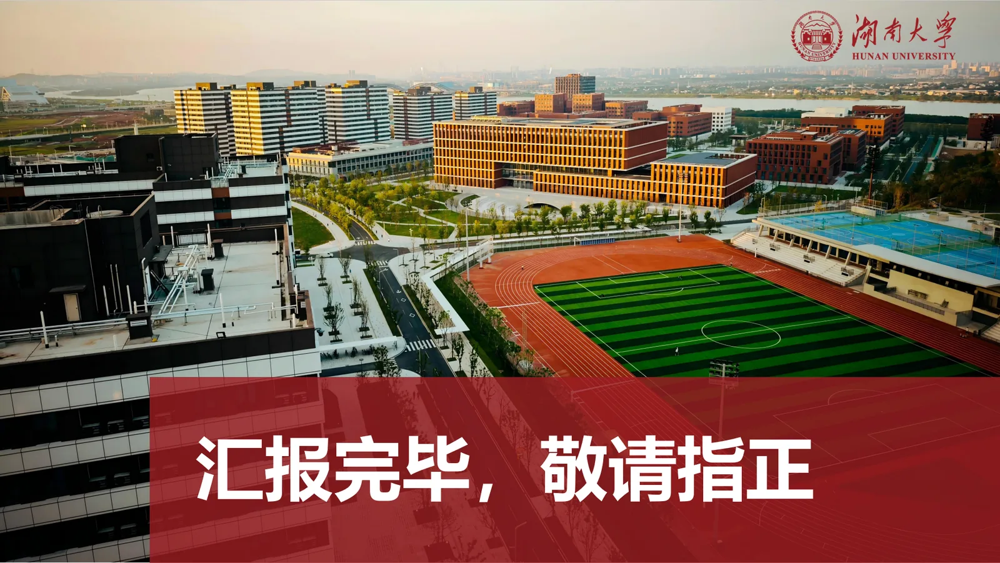

# academic-native-ppt-design-HNU-style

**基于湖南大学风格模板的学术 PPT 设计 Skill。** 生成**纯原生可编辑**的 `.pptx`：文本框、形状、表格保持 DrawingML 对象，打开 PowerPoint 或 WPS 可直接改字、改色、挪框，而不是贴图稿或改不动的自动排版。

以湖南大学标准母版为底板，服务**学术汇报**（组会、答辩、开题、项目评审）与严谨的**工程方案汇报**。版式、字阶、印章避让与门禁检查写成可执行规则，由 Agent 自动套用。

**Skill 版本 v5.0.0（formal_release）** · 姊妹仓库：[Unified-Scholarflow-Skills](https://github.com/w5711112/Unified-Scholarflow-Skills)

---

## 解决什么问题

| 实际卡点 | 自动交付的结果 |
| --- | --- |
| 模板版式不统一，边框字号靠手感 | **自动**套用湖大母版与 12 套非对称版式原型 |
| 每页从空白画布硬拖，耗时且不稳 | **自动**按内容关系选版式再填图文 |
| 字粘在一起、文出框、印章被压住 | **自动**按字阶/行距档位排版，**印章区留空** |
| 粘贴 Markdown 星号进幻灯片 | **`audit_hnu_deck.py` 自动**检查并拦下 |
| 成品要能继续改 | 输出**原生可编辑** `.pptx`，不是图片页 |

规则带有维护者的汇报密度习惯（分点数量、页面节奏），可按需调整字阶与分栏。

---

## 效果（10 张）

下列为实际成品截屏。完整分辨率见 `docs/images/。





















> **图 1–10 · academic-native-ppt-design-HNU-style 实际生成效果。**  
> 【湖南大学母版底板 + 分体式非对称多边形卡片；湖大红与学术深蓝语义配色；左下印章/建筑水印自动避让。页面保持**原生可编辑**，不是截图拼贴。】

---

## 为什么单独成仓

湖大母版、印章禁飞、字阶门禁与通用学术 PPT 分属不同规则集。拆仓后检索与安装路径更清楚。

主仓库 [Unified-Scholarflow-Skills](https://github.com/w5711112/Unified-Scholarflow-Skills) 负责检索、精读、笔记与治理。两仓互链：从科研链能到高质量汇报出口，做 PPT 时也能回到文献与笔记来源。

---

## 几条代表规则

完整条文见 `SKILL.md` 与 `references/`（Rules 1–41、QG-01–QG-41）。

1. **事实按来源写。** 参考材料中的技术栈、指标与名词原样使用，不编造未出现的模块或数字。  
2. **双模态字阶（QG-03）。** 精炼页正文约 **16–18 pt**；高密页 **13–14.5 pt** 并配合多子区域拆分；大标题不超过 **28 pt**。部分历史参考写「绝对 ≥14 pt」时，执行以最新主 Skill 与 QG-03 为准。  
3. **行距与间距有档位。** 行距大约 **18–20 pt**，横向紧凑间距 **6–12 pt**，上下独立区域至少 **15 pt**，避免字粘连与死白。  
4. **印章禁飞区。** 左下角印章与建筑水印区域**自动避开**正文卡片，不压线、不遮标志。  
5. **原生可编辑。** 文本框、形状、表格保持 DrawingML 对象；禁整页位图冒充 PPT，禁 Markdown 符号泄漏到页面。  
6. **自动门禁。** `scripts/audit_hnu_deck.py` 检查字号下限、出框、卡片净高、Markdown 泄漏等，减少目检遗漏。

---

## 仓库结构

```text
academic-native-ppt-design-HNU-style/
├─ SKILL.md              # 主规则（触发条件、红线、流程）
├─ references/           # 模板体系、版式原型、字阶、门禁、原生可编辑
├─ scripts/              # 模板引擎、审计脚本、示例生成
├─ templates/            # 湖大母版
├─ assets/               # 辅助素材
├─ docs/images/          # 上列 10 张效果图
├─ RELEASE_NOTES.md
└─ README.md
```

---

## 安装与使用

```powershell
git clone https://github.com/w5711112/academic-native-ppt-design-HNU-style.git
# 完整目录放入技能路径，例如 ~/.agents/skills/academic-native-ppt-design-HNU-style/
```

在 **Codex、Claude Code、Kimi Code、MiMo Desktop** 等宿主中，提到「湖大 PPT / HNU PPT / 湖南大学模板」即可触发。生成后执行：

```powershell
python scripts\audit_hnu_deck.py --input <path_to_deck.pptx>
```

依赖以 `scripts/` 说明为准（通常需要 **python-pptx**）。

---

## 使用边界

母版与印章素材按学校视觉规范整理与再实现，使用时遵守学校标识规定。自动门禁覆盖字阶、溢出与结构问题；内容是否适合具体场合由作者判断。

安全问题见 [SECURITY.md](SECURITY.md)。

## Related

- 科研检索、精读、绘图与治理：[Unified-Scholarflow-Skills](https://github.com/w5711112/Unified-Scholarflow-Skills)

## 许可

[LICENSE](LICENSE) · [THIRD_PARTY_NOTICES.md](THIRD_PARTY_NOTICES.md)

---

## English summary

**academic-native-ppt-design-HNU-style** is a PPT skill built on the Hunan University visual template for **academic** talks and structured engineering briefings. Output is **native editable** `.pptx` (DrawingML text, shapes, tables). Layout archetypes, dual-mode type scales, seal keep-out zones, and `audit_hnu_deck.py` gates are applied automatically.

Companion of [Unified-Scholarflow-Skills](https://github.com/w5711112/Unified-Scholarflow-Skills).
